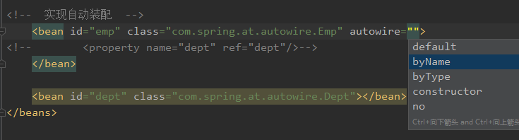

# Spring5框架

## 一、基本概念

### 1）Spring是轻量级的开源的J2EE的应用程序框架，对bean的生命周期进行管理。

### 2）Spring可以解决企业应用开发的复杂性

### 3）Spring有两个核心部分：IOC和AOP

​		IOC：控制反转，将原始的创建对象（new Object）过程交给Spring进行管理

​		AOP：面向切面，不修改源代码的条件下增强功能、

### 4） Spring特点

1. 方便解耦，简化开发
2. AOP编程的支持
3. 方便程序测试
4. 方便集成其他框架
5. 方便进行事务的操作
6. 降低api的开发难度

### 5）入门案例

1 下载Spring5 最新版本5.2.9


2. 创建maven工程，导入依赖。核心jar包

3.创建一个普通类

```java
public class User {
    public void add(){
        System.out.println("add........");
    }
}
```

4.创建Spring的配置文件，在配置文件中配置要创建的对象

1. 创建一个.xml格式的配置文件

2. 配置文件添加对User类的配置管理

   ```java
   <?xml version="1.0" encoding="UTF-8"?>
   <beans xmlns="http://www.springframework.org/schema/beans"
          xmlns:xsi="http://www.w3.org/2001/XMLSchema-instance"
          xsi:schemaLocation="http://www.springframework.org/schema/beans http://www.springframework.org/schema/beans/spring-beans.xsd">
       <!--配置相关User类对象创建-->
       <bean id="user" class="com.spring.at.bean.User"></bean>
   </beans>
   ```

5.进行测试代码编写

```java
@Test
public void addTest(){
    //1 加载spring的配置文件，将配置文件中的javaBean加载出来。
    ApplicationContext applicationContext = new ClassPathXmlApplicationContext("applicationContext.xml");
    //2 获取在配置文件中创建的对象
    User user = applicationContext.getBean("user", User.class);
    user.add();
}
```

控制台输出：

```
User类被初始化加载成功............
add........
```


## 二、IOC容器

### 1）底层原理

#### 	1、什么是IOC？

- 控制反转，把对象创建和对象之间的调用过程，交给Spring进行管理
- 目的：为了降低耦合度
- 做的入门案例就是一种Ioc的实现

####     2、底层原理

​	xml解析，工程模式，反射

####     3、画图解释

### 2）接口（BeanFactory）

#### 1、IOC思想基于IOC容器完成，IOC容器底层就是对象工厂

#### 2、Spring提供IOC容器实现的两种方式：（接口）

##### （1）BeanFactory

IOC容器的最基本的实现方式，是Spring内部使用的接口，一般不提供给开发人员使用。

**加载配置文件的时候不会创建对象，只有在获取或者使用对象的时候才会去创建对象**

```java
Resource resource = new ClassPathResource("applicationContext.xml");
BeanFactory factory = new XmlBeanFactory(resource);
//提供一种延迟加载思想来创建对象。bean对象什么时候使用什么时候创建，加载了配置文件的时候并没有创建
```

##### （2）ApplicationContext

BeanFactory的子接口，功能更多更强大，一般由开发人员使用。

**加载配置文件的时候就会把配置文件中的对象立即创建**

```java
ApplicationContext applicationContext = new ClassPathXmlApplicationContext("applicationContext.xml");
//提供一种立即加载思想来创建对象。只要解析完配置文件，就立马创建bean对象。
```

##### （3）ApplicationContext接口有实现类


```java
new FileSystemXmlApplicationContext("E:\work\springboot\spring\src\main\resources\applicationContext.xml");//参数填写文件绝对路径
new ClassPathXmlApplicationContext("applicationContext.xml");//参数写文件的类路径
```

### 3）操作Bean管理（基于xml配置文件）

```xml
<!--配置相关User类对象创建，并且给user的name属性赋值，属性必须实现setter方法-->
<bean id="user" class="com.spring.at.bean.User"></bean>
```

1、基于xml配置文件创建对象

（1）在Spring配置文件中，添加bean标签，里面添加对应的属性就可以实现对象的创建

（2）bean标签的常用的属性：

- id：唯一标识
- class：类的全路径（包类路径）
- name：也可作为标识，一般不用，能写特殊字符

（3）创建对象的时候默认的调用类的无参构造方法，如果类中只实现了有参构造方法而没有手动实现无参构造方法加载配置文件时会报错（找不到该方法）。

2、基于xml配置文件注入属性

（1）DI ：依赖注入，就是注入属性。

```java
public class Book {
    private String name;
	//通过xml注入属性必须实现set方法
    public void setName(String name) {
        this.name = name;
    }
}
```

```xml
<bean id="book" class="com.spring.at.bean.Book">
    <property name="name" value="葵花宝典"/>
</bean>
```

3、有参构造方法注入属性

（1）创建类，编写有参构造函数

```java
public class Orders {
    private String ID;
    private String num;

    public Orders(String id,String number){
        this.ID = id;
        this.num = number;
    }
}
```

（2）配置文件添加bean标签，配置有参构造属性<constructor-arg>设置有参构造函数的参数值

```xml
    <bean id="orders" class="com.spring.at.bean.Orders">
        <constructor-arg name="id" value="111"/>
        <constructor-arg name="number" value="一亿个"/>
<!--        <constructor-arg index="0" value="110"/>-->
<!--        <constructor-arg index="1" value="一万个"/>-->
    </bean>
```

4、xml方式注入其他类型的属性

（1）注入null值

```xml
<property name="name">
    <null/>
</property>
```

（2）注入特殊符号

```xml
<!--属性值包含特殊符号
    1 把<>进行转义 &lt;&gt
    2 把带特殊符号的内容写到CDATA中去
    -->
<property name="name">
    <value><![CDATA[<<葵花宝典>>]]></value>
</property>
```

（3）注入外部bean

1. 创建两个类service和dao类

   ```java
   public class UserService {
       private UserDaoInter UserDaoInter;
       public void setUserDaoImp(UserDaoInter UserDaoInter) {
           this.UserDaoInter = UserDaoInter;
       }
       public  void add(){
           System.out.println("service add");
           UserDaoInter.update();
       }
   
   }
   ```

   ```java
   public class UserDaoImp implements UserDaoInter{
       public void update() {
           System.out.println("userDao update");
       }
   }
   ```

   ```java
   package com.spring.at.dao;
   
   public interface UserDaoInter {
        void update();
   }
   ```

2. 在service中调用dao的方法

3. 在Spring配置文件中进行配置

   ```xml
   <bean id="userDao" class="com.spring.at.dao.UserDaoImp"/>
   <bean id="userService" class="com.spring.at.service.UserService">
       <property name="userDaoImp"  ref="userDao"/>
   </bean>
   ```

4. 测试

   ```java
   @Test
   public void OrdersTest(){
       ApplicationContext applicationContext = new ClassPathXmlApplicationContext("applicationContext.xml");
       UserService userService = applicationContext.getBean("userService",UserService.class);
       userService.add();
   }
   ```

（4）注入内部bean和级联bean

（5）IOC操作bean管理（FactoryBean）

**Spring有两种bean，一种是普通的bean，另一种工厂bean（FactoryBean）** 

- 普通bean：在配置文件中定义的bean类型就是返回类型

- 工厂bean：在配置文件中定义的bean类型可以和返回的类型不一致

  - 创建类作为工厂bean：实现FactoryBean接口

  - 实现接口的方法里面定义返回的bean类型

    ```java
    public class MyFactoryBean implements FactoryBean<Book> {
        //定义返回的bean
        public Book getObject() throws Exception {
            Book book = new Book();
            book.setName("九阴真经");
            return book;
        }
    
        public Class<?> getObjectType() {
            return null;
        }
    
        public boolean isSingleton() {
            return false;
        }
    }
    ```

    ```java
    @Test
    public void factoryBeanTest(){
        ApplicationContext applicationContext = new ClassPathXmlApplicationContext("applicationContext.xml");
        Book myFactoryBean = applicationContext.getBean("myFactoryBean",Book.class);
        System.out.println(myFactoryBean);
    
    }
    ```

    ```xml
    <bean id="myFactoryBean" class="com.spring.at.factoryBean.MyFactoryBean"></bean>
    ```

  （6）IOC操作bean管理（bean的作用域）

  ​	**Spring配置文件中可以设置创建的bean实例是单实例还是多实例（默认情况下是单实例）**	

  - scope设置为singleton时，在加载配置文件的时候就会创建这个单例bean对象
  - scope设置为prototype时，会在调用getBean方法获取bean对象实例时创建多实例对象	

  ```xml
  <!--单实例的bean-->
  <bean id="user1" class="com.spring.at.bean.User" scope="singleton"></bean>
  <!--多实例的bean-->
  <bean id="user2" class="com.spring.at.bean.User" scope="prototype"></bean>
  ```

  ```java
  @Test
  public void scopeTest(){
      ApplicationContext applicationContext = new ClassPathXmlApplicationContext("applicationContext.xml");
      User a1 = applicationContext.getBean("user1",User.class);
      User a2 = applicationContext.getBean("user1",User.class);
      User b1 = applicationContext.getBean("user2",User.class);
      User b2 = applicationContext.getBean("user2",User.class);
      System.out.println(a1+"\n"+a2+"\n"+b1+"\n"+b2);
  }
  ```

  ```yaml
  //控制台输出获取的两个user1的bean对象的地址一样，user2的两个bean对象地址不一样
  User类被初始化加载成功............
  User类被初始化加载成功............
  User类被初始化加载成功............
  com.spring.at.bean.User@365185bd
  com.spring.at.bean.User@365185bd
  com.spring.at.bean.User@18bf3d14
  com.spring.at.bean.User@4fb64261
  ```

  

  （7）IOC操作bean管理（bean的生命周期）

     **生命周期：从创建到销毁的过程**

  1. 通过构造器创建bean实例（无参构造函数）	

  2. 为bean的属性设置值或对其他bean的引用（调用set方法）

  3. 把bean的实例传递给bean后置处理器的方法postProcessBeforeInitialization

  4. 调用bean的初始化的方法（需要进行配置） 

     - ```xml
       <bean id="book" class="com.spring.at.bean.Book" init-method="initMethod">
       ```

  5. 把bean的实例传递给bean后置处理器的方法postProcessAfterInitialization

  6. bean可以使用了（getBean()获取到了）

  7. 销毁：当容器在关闭的时候会调用bean中的销毁方法（需要进行配置）

     ```xml
     <bean id="book" class="com.spring.at.bean.Book" init-method="initMethod" destroy-method="destroy">
     ```

     ```java
     @Test
     public void initMethod(){
         ApplicationContext applicationContext = new ClassPathXmlApplicationContext("applicationContext.xml");
         Book book = applicationContext.getBean("book",Book.class);
         //applicationContext调用close方法的时候就会执行配置文件中的bean中属性destroy-method的方法
         ((ClassPathXmlApplicationContext)applicationContext).close();
     }
     ```

  **后置处理器**

  1. 创建类实现BeanPostProcessor接口并实现两个方法

     ```java
     //bean后置处理器
     public class BookBeanPostProcesser implements BeanPostProcessor {
         public Object postProcessBeforeInitialization(Object bean, String beanName) throws BeansException {
             System.out.println("在初始化bean之前执行的方法");
             return bean;
         }
     
         public Object postProcessAfterInitialization(Object bean, String beanName) throws BeansException {
             System.out.println("在初始化bean之后执行的方法");
             return bean;
         }
     }
     ```

  2. 在spring配置文件中配置后置处理器的bean

     ```xml
     <!--配置后置处理器,会为当前配置文件中的所有bean添加后置处理器-->
     <bean id="myBeanPost" class="com.spring.at.beanPostProcesser.BookBeanPostProcesser"/>
     ```

  3. 控制台输出(会在每一个bean加载的前后都执行一次这两个方法，是公共的)

     ```
     在初始化bean之前执行的方法
     initMethod 执行
     在初始化bean之后执行的方法
     ```

     

  （8）IOC操作bean管理（xml自动装配）

  1. 什么是自动装配？

     根据指定自动配置规则（属性名称或者类型），Spring将自动匹配的属性值进行注入。

  2. 演示自动装配过程：

     xml配置：

     autowire=“byName” ：根据名称注入，注入的属性的bean的id要和属性类名称一致

     autowire=“btType”：根据类型注入，但是相同类型的bean不能定义多个，否则会找不到自动注入哪个而报错

     

  

  （9）IOC操作bean管理（引入外部配置文件）

   1. 直接配置数据库信息

      - 配置德鲁伊连接池

        ```xml
        <!--配置德鲁伊连接池对象-->
        <bean id="dataSource" class="com.alibaba.druid.pool.DruidDataSource">
            <property name="driverClassName" value="com.ibm.db2.jcc.DB2Driver"/>
            <property name="url" value="jdbc:db2://47.100.186.110:6014/aclife"/>
            <property name="username" value="db2inst1"/>
            <property name="password" value="db2inst1"/>
        </bean>
        ```

  	2. 通过外部配置文件

      - 创建外部配置文件dataSource.properties

        ```properties
        prop.driverClass=com.ibm.db2.jcc.DB2Driver
        prop.url=jdbc:db2://47.100.186.110:6014/aclife
        prop.username=db2inst1
        prop.password=db2inst1
        ```

      - 引入名称空间到spring配置文件中

        ```xml
        <!--引入名称空间context-->
        <beans xmlns="http://www.springframework.org/schema/beans"
               xmlns:xsi="http://www.w3.org/2001/XMLSchema-instance"
               xmlns:context="http://www.springframework.org/schema/context"
               xsi:schemaLocation="http://www.springframework.org/schema/beans http://www.springframework.org/schema/beans/spring-beans.xsd
                                    http://www.springframework.org/schema/context  http://www.springframework.org/schema/context/spring-context.xsd">
        ```

      - 将外部配置文件引入到spring配置文件中来

        ```xml
        <context:property-placeholder location="dataSource.properties"></context:property-placeholder>
        <bean id="dataSource2" class="com.alibaba.druid.pool.DruidDataSource">
            <property name="driverClassName" value="${prop.driverClass}"/>
            <property name="url" value="${prop.url}"/>
            <property name="username" value="${prop.username}"/>
            <property name="password" value="${prop.password}"/>
        </bean>
        ```


### 4）操作Bean管理（基于注解方式）

#### 	1. 什么是注解？

​			（1）注解是代码特殊的标记，格式： @注解名称（属性名称：属性值，属性名称2：属性值2.........）

​			（2）注解可以作用在类、方法和属性上面

​			（3）使用注解的目的：简化xml的配置

#### 	2. Spring针对Bean管理操作中的创建对象 

- @Component 普通组件

- @Service

- @Controller

- @Repository					

  **上面的四个注解功能是一样的，都可用来创建bean实例对象，开发人员可以根据开发需求将四个注解运用到不同的层中**

#### 3. 基于注解方式实现bean的创建

1. 引入依赖 

   ```xml
   <!--引入aop依赖，用于使用注解-->
   <!-- https://mvnrepository.com/artifact/org.springframework/spring-aop -->
   <dependency>
       <groupId>org.springframework</groupId>
       <artifactId>spring-aop</artifactId>
       <version>5.2.6.RELEASE</version>
   </dependency>
   ```

2. 开启组件扫描功能，告诉spring容器要在哪个路径下面开启注解功能使用，进行扫描，需要添加Spring-context命名空间

   ```xml
   <?xml version="1.0" encoding="UTF-8"?>
   <beans xmlns="http://www.springframework.org/schema/beans"
          xmlns:context="http://www.springframework.org/schema/context"
          xmlns:xsi="http://www.w3.org/2001/XMLSchema-instance"
          xsi:schemaLocation="http://www.springframework.org/schema/beans http://www.springframework.org/schema/beans/spring-beans.xsd
                               http://www.springframework.org/schema/context http://www.springframework.org/schema/context/spring-context-4.0.xsd">
   
       <context:component-scan base-package="com.spring.at"></context:component-scan>
   </beans>
   ```

3. 编写被注解标记的类

   ```java
   import org.springframework.beans.factory.annotation.Value;
   import org.springframework.stereotype.Component;
   //@Component： value值等同于bean标签的id属性  默认值是类名首字母小写
   @Component(value = "books")
   public class Book {
       //@Value：给属性注入默认值
       @Value(value = "九阴真经")
       private String name;
       public Book(){
           System.out.println("Book constructor");
       }
       @Override
       public String toString() {
           return "Book{" +
                   "name='" + name + '\'' +
                   '}';
       }
   }
   ```

4. 开启组件扫描配置的细节（有些情况不想让包下面的所有类都被扫描，可以设置）

   - ```xml
     <!-- 实例一
         use-default-filters="false" 表示现在不使用默认的filter，自己配置filter
         context:include-filter ，设置扫描哪些注解标记的类
         相当于只扫描加载@Controller注解标记的类
      -->
     <context:component-scan base-package="com.spring.at" use-default-filters="false">
         <context:include-filter type="annotation" expression="org.springframework.stereotype.Controller"/>
         <context:include-filter type="annotation" expression="org.springframework.stereotype.Component"/>
     </context:component-scan>
     ```

   - ```xml
     <!-- 实例二
         默认扫描所有包下面的类
         context:exclude-filter,设置不被扫描的类
         相当于不扫描@Service注解标记的类
      -->
     <context:component-scan base-package="com.spring.at.bean">
         <context:exclude-filter type="annotation" expression="org.springframework.stereotype.Service"/>
     </context:component-scan>
     ```


#### 4. 基于注解方式实现属性的注入

1. @AutoWire：根据属性类型进行自动注入

   - 把service和dao对象进行创建，在**service和dao的实现类**上添加创建对象的注解

   - 在service中注入dao的对象，**在service类里面添加dao接口类的属性，在属性上面添加@AutoWire注解，不需要添加set方法**

     ```java
     @Service
     public class UserService {
         @Autowired
         private UserInter userInter;
         
         public void add() {
             System.out.println("service add");
             userInter.add();
         }
     }
     ```

2. @ Qualifier：根据属性名称进行自动注入

   **这个注解要和上面的@AutoWire一起进行使用。当service的dao接口类有多个实现类自动装载的时候，需要用@Qualifier(value="dao接口实现类的装载值")来指定调用哪个实现类。**

   ```java
   @Autowired
   @Qualifier(value = "userImpl2")//代表userInter接口的实现类是用的UserImpl2这个类
   private UserInter userInter;
   ```

3. @Resource：可以根据类型也可以根据名称注入

   ```java
   //@Resource   //根据属性注入
   @Resource(name = "userImpl2")//根据属性和名称注入，等同于上面两个一起用
   private UserInter userInter;
   ```

4. @Value：注入普通类型属性

#### 5. 完全注解开发(实战开发中就用SpringBoot)

1. ​	创建配置类替代配置文件，用@Configuration标注

   ```java
   @Configuration
   @ComponentScan(basePackages = "com.spring.at") //等价于配置文件中注解扫描包路径的配置
   public class SpringConfig {
   
   }
   ```

2. 编写测试类，加载配置类    **new AnnotationConfigApplicationContext(SpringConfig.class);**

   ```java
   //加载配置文件转化成加载配置类
   ApplicationContext applicationContext = new AnnotationConfigApplicationContext(SpringConfig.class);
   ```

## 三、AOP

## 四、JdbcTemplate

## 五、事务管理

## 六、spring5的新特性


